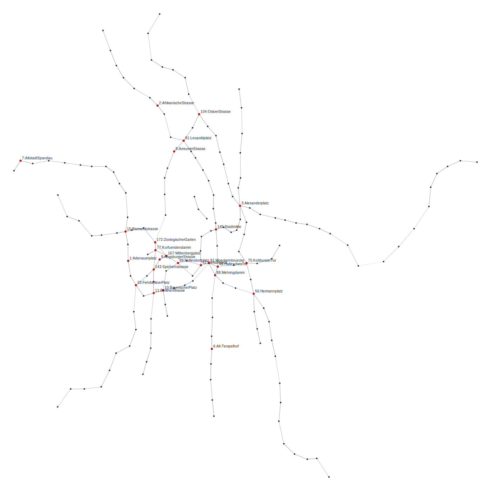

# 选项2：城市地铁出行路径规划

## 引言

现代城市交通系统中，地铁网络通常由多个车站和线路构成。乘客出行时，希望找到从起点到终点的最优路径，以减少出行时间成本。

  

Berlin 2010 年地铁网络

地铁系统可以抽象为一个 **图（Graph）** 模型，其中：
- 每个车站作为图的一个节点（Node）。
- 每条地铁线路作为图的一条边（Edge），边的权重表示通过该线路的时间成本。

这样，我们可以将地铁出行路径规划问题建模为一个 **最短路径问题（Shortest Path Problem）**，目标是找到从起点到终点的最短路径。

## 实验要求

请将城市地铁网络建模为一个带权图，并完成以下分析：
- 构建地铁网络图模型（节点，边，权重）
- 实现 Dijkstra 算法求解最优出行路径
  - 给定任意起点站 $s$ 和终点站 $t$，求解从 $s$ 到 $t$ 的最短路径。
  - 输出最短路径的时间成本和具体的地铁站序列
  - 请对求解结果进行可视化展示，高亮最优路径
- [Optional] 考虑换乘时间
  - 如果乘客在某个车站进行换乘，需要额外增加换乘时间（假设换乘时间恒定），请在路径计算中考虑该因素

实验中需要的数据见 [data](./data) 文件夹；数据格式说明请见 [data/README.md](./data/README.md)。 **选择 3 座城市进行求解即可。**

> 数据来源：[Data for the 15 largest metro systems worldwide (2010)](https://explore.openaire.eu/search/dataset?pid=10.5281%2Fzenodo.17635286)
