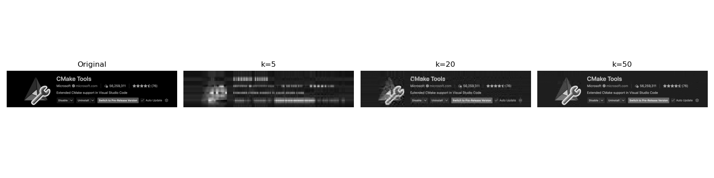
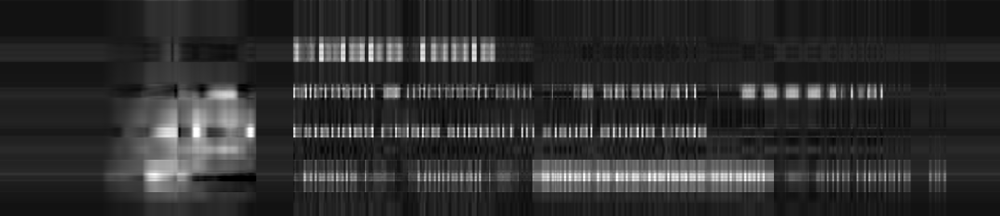
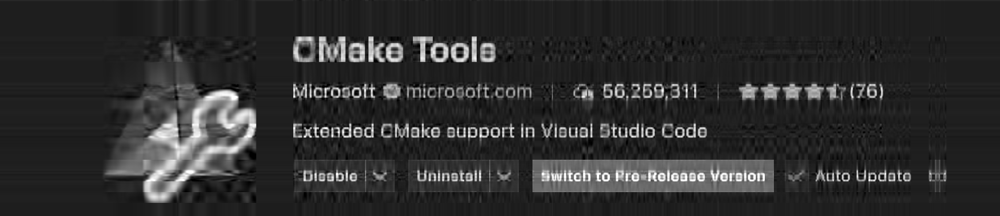

# SVD 图像压缩 — 实验报告（草稿）

**作者**: （待填）

## 摘要

本项目实现并验证了基于奇异值分解（SVD）的灰度图像压缩方法。要求“不可调用高阶库 SVD 函数”，因此我们通过对 $A^T A$ 或 $A A^T$ 进行特征值分解来实现 SVD，从而得到 $A=U\Sigma V^T$。实验在仓库示例图片上运行，使用不同保留秩 $k$ 进行重构，并用 PSNR 与（全局）SSIM 评估压缩质量。

## 数学模型与算法

给定一幅 $m\times n$ 的灰度图像矩阵 $A$，其 SVD 为
$$A = U \Sigma V^T$$
其中 $U\in\mathbb R^{m\times r}$，$V\in\mathbb R^{n\times r}$，$\Sigma=\mathrm{diag}(\sigma_1,\dots,\sigma_r)$，$r=\min(m,n)$，奇异值按非增顺序排列。

若仅保留前 $k$ 个奇异值与对应向量，则得到秩-$k$ 近似：
$$A_k = \sum_{i=1}^k \sigma_i u_i v_i^T = U_k \Sigma_k V_k^T$$

实现细节：当 $m\ge n$ 时计算 $A^TA$（$n\times n$）的特征分解 $A^TA=V\Lambda V^T$，奇异值为 $\sigma_i=\sqrt{\lambda_i}$，再用 $u_i = (A v_i)/\sigma_i$；当 $n>m$ 时对 $AA^T$ 做类似处理以求 $U$，然后计算 $V$。

该方法避免直接调用 `numpy.linalg.svd`，但使用了 `numpy.linalg.eigh` 来做对称矩阵的特征分解。

时间复杂度：若直接对 $A^TA$（或 $AA^T$）做完整特征分解，复杂度为 $O(\min(m,n)^3)$，适用于中小尺寸图像（本实验用于例图验证）。

## 实现说明

- 主要代码文件：
  - `svd_impl.py`：手写 SVD（基于特征分解）与 `reconstruct` 函数。 
  - `metrics.py`：实现 `psnr()` 与一个全图 SSIM `ssim()`（简化版，非滑动窗口）。
  - `compress.py`：把灰度图像读入、调用 SVD 并按给定 `k` 重构、保存重构图像与汇总图。

运行示例：
```
python3 compress.py --input ../../imgs/CMakeTools.png --k 5 20 50 --outdir demo_out
```

## 实验与结果

我们在仓库提供的图片 `imgs/CMakeTools.png` 上运行压缩，选取 $k=5,20,50$ （运行于 `hw_2/option1/demo_out`）。控制台输出：

- k=5: PSNR=20.417, SSIM=0.8197
- k=20: PSNR=24.997, SSIM=0.9431
- k=50: PSNR=32.372, SSIM=0.9901

报告中应包含 `demo_out/summary.png`（已生成）以直观比较重构效果：随着 $k$ 增大，重构图像与原图的误差快速下降。

### 可视化结果

下面给出原图与三种秩-$k$ 重构的比较图（已保存于 `hw_2/option1/demo_out`）。

原图（左）与重构样例（右）：



另外分别展示单独重构结果：

- k=5 重构：



- k=20 重构：



- k=50 重构：


## 分析与讨论

- SVD 压缩的核心思想是保留图像矩阵的主要能量（前若干奇异值），低秩近似常能很好地恢复视觉上重要的结构（边缘、纹理等），同时显著降低存储（只需保存 $U_k$ 的列、$\Sigma_k$ 与 $V_k$ 的行）。
- 实际应用中，对大尺寸图像需要分块（block-wise SVD）或采用更高效的数值方法（截断特征值解法、随机 SVD 等）以降低时间与内存开销。
- SSIM 实现为全图全局指标，建议扩展为滑动窗口版本以更接近标准 SSIM 度量。

## 使用与复现实验说明

依赖：`numpy`、`Pillow`、`matplotlib`。

安装（推荐 Conda 或 pip 环境）：
```bash
pip install -r requirements.txt
```

生成 PDF（若本机安装 `pandoc` 或 `pandoc`+`xelatex`）：
```bash
# 在 hw_2/option1 下
pandoc report.md -o report.pdf --pdf-engine=xelatex
```

## 进一步工作（可选）

- 将 `svd_impl` 替换为截断或随机化 SVD 提升速度与扩展性。
- 实现彩色图像的三通道分解或采用分块策略处理大图像。
- 实现滑动窗口 SSIM 与更多客观指标（如 MSSIM、MS-SSIM）。
- 添加交互式 GUI 便于调参与可视化（已在 TODO 中列出）。

## 参考文献

- Golub, G. H., & Van Loan, C. F. (2013). Matrix Computations.
- Wang, Z., Bovik, A. C., Sheikh, H. R., & Simoncelli, E. P. (2004). Image quality assessment: from error visibility to structural similarity.