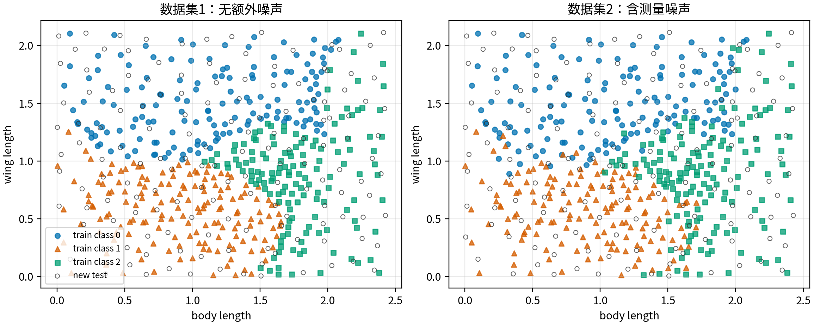
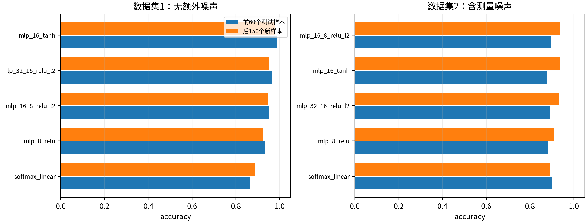
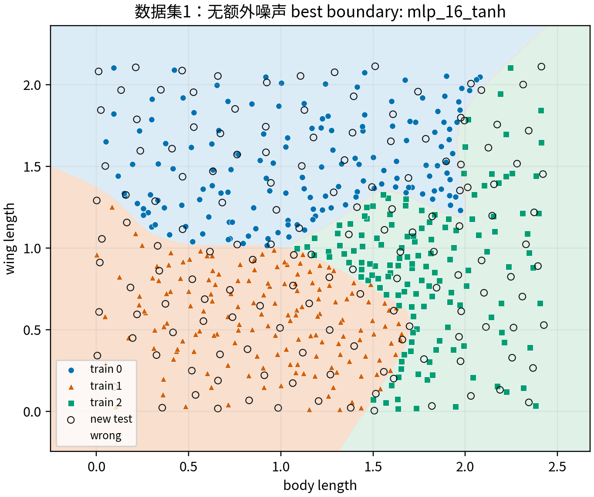
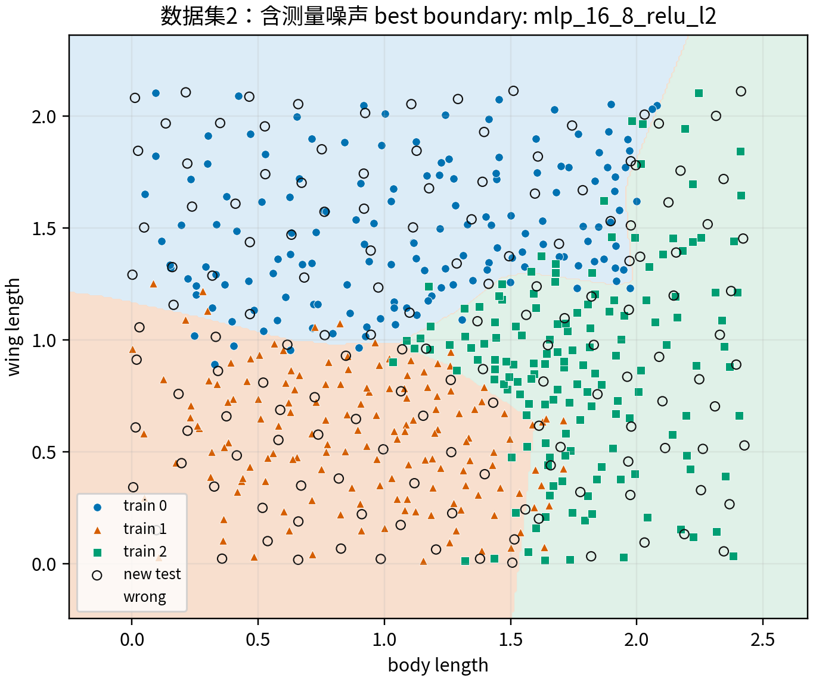
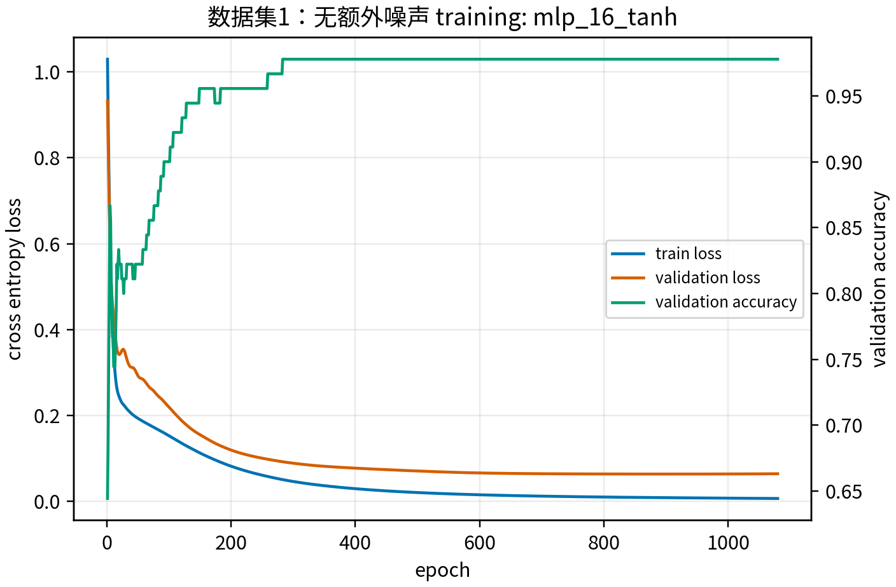
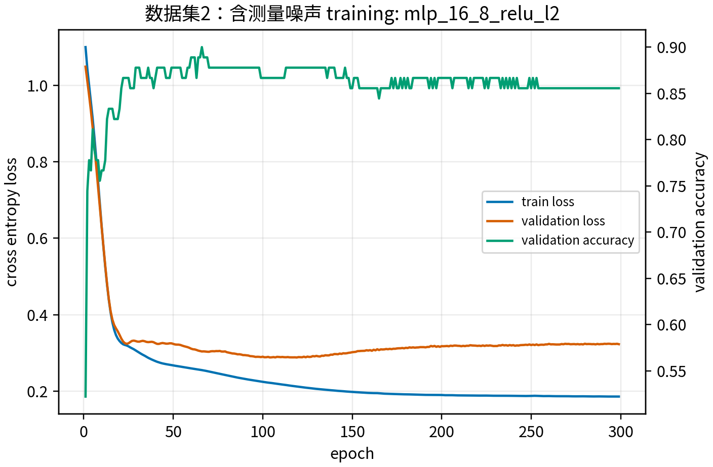

# 1 问题与建模

本实验选择选项2。目标是利用昆虫的体长 $x_1$ 与翼长 $x_2$ 两个特征，将样本分类到 0、1、2 三个类别。训练集记为
$$
\mathcal D=\{(\mathbf x_i,y_i)\}_{i=1}^n,\quad \mathbf x_i=(x_{i1},x_{i2})\in\mathbb R^2,\ y_i\in\{0,1,2\}.
$$
神经网络输出三维 logit 向量 $z=f_\theta(\mathbf x)$，再用 softmax 得到类别概率
$$
p_k(\mathbf x)=\frac{e^{z_k}}{\sum_{j=0}^2 e^{z_j}}.
$$
训练目标为最小化交叉熵损失
$$
L(\theta)=-\frac1n\sum_i \log p_{y_i}(\mathbf x_i).
$$
分类规则为 $\hat y=\arg\max_k p_k(\mathbf x)$。

为避免不同量纲影响训练，所有模型均只使用训练集估计均值与标准差，并对训练集、验证集、测试集做同一标准化变换。训练集内部按类别分层划分出 20\% 作为验证集，用于早停和比较网络参数；测试集只在最终评价时使用。

# 2 算法实现

实现使用 `PyTorch`，运行环境为已有 conda 环境 `cupy`。为了考察网络参数影响，实验比较了线性 softmax 分类器、单隐层 MLP、不同激活函数以及带 L2 正则的双隐层 MLP。优化器使用 Adam，损失函数使用交叉熵。每种设置使用 5 个随机种子重复实验，报告平均值与标准差。

测试集按作业要求拆成两段评价：前 60 个样本来自训练数据的随机抽取，可观察模型对已知分布/近似已见样本的拟合能力；后 150 个样本不在训练集中，更能衡量模型对新昆虫数据的泛化能力。因此报告中更重视后 150 个样本的准确率。

# 3 数据可视化

从散点图可见，数据集1的三类样本分界较清晰；数据集2加入测量噪声后，同类样本更分散，类别边界附近的重叠更明显，分类难度更高。因此数据集2更需要适当的正则化和验证集早停，以降低过拟合风险。

# 4 参数对比结果

下表中 `seen60` 表示测试集前 60 个样本准确率，`new150` 表示后 150 个新样本准确率，`all210` 表示全部测试样本准确率。

| dataset        | config            | seen60        | new150        | all210        | epochs |
| -------------- | ----------------- | ------------- | ------------- | ------------- | ------ |
| dataset1_clean | mlp_16_tanh       | 0.987 ± 0.007 | 0.977 ± 0.017 | 0.980 ± 0.013 | 803    |
| dataset1_clean | mlp_32_16_relu_l2 | 0.963 ± 0.036 | 0.949 ± 0.034 | 0.953 ± 0.034 | 473    |
| dataset1_clean | mlp_16_8_relu_l2  | 0.950 ± 0.066 | 0.947 ± 0.034 | 0.948 ± 0.042 | 545    |
| dataset1_clean | mlp_8_relu        | 0.933 ± 0.046 | 0.925 ± 0.044 | 0.928 ± 0.044 | 537    |
| dataset1_clean | softmax_linear    | 0.863 ± 0.007 | 0.889 ± 0.004 | 0.882 ± 0.002 | 690    |
| dataset2_noisy | mlp_16_8_relu_l2  | 0.897 ± 0.014 | 0.937 ± 0.029 | 0.926 ± 0.021 | 306    |
| dataset2_noisy | mlp_16_tanh       | 0.880 ± 0.022 | 0.937 ± 0.004 | 0.921 ± 0.006 | 338    |
| dataset2_noisy | mlp_32_16_relu_l2 | 0.890 ± 0.015 | 0.933 ± 0.024 | 0.921 ± 0.016 | 479    |
| dataset2_noisy | mlp_8_relu        | 0.883 ± 0.017 | 0.912 ± 0.028 | 0.904 ± 0.016 | 446    |
| dataset2_noisy | softmax_linear    | 0.900 ± 0.012 | 0.893 ± 0.007 | 0.895 ± 0.003 | 733    |

数据集1最佳模型为 `mlp_16_tanh`，后 150 个新样本准确率为 **0.977 ± 0.017**，全部测试准确率为 **0.980 ± 0.013**。数据集2最佳模型为 `mlp_16_8_relu_l2`，后 150 个新样本准确率为 **0.937 ± 0.029**，全部测试准确率为 **0.926 ± 0.021**。

# 5 最佳模型分类边界

决策边界显示，神经网络能够学习到非线性的类别分割曲线。线性模型只能给出直线边界，在类别形状较弯曲或噪声较强时表达能力不足；双隐层 ReLU 网络可以形成更灵活的分段线性边界，但如果网络过大且缺少正则化，也可能把边界拉向个别噪声点。实验中带 L2 正则与早停的双隐层模型通常在新样本上更稳定。

# 6 训练过程

训练曲线表明，交叉熵损失快速下降后趋于稳定。验证集准确率没有继续提升时触发早停，可以减少后续迭代对训练集局部噪声的记忆。

# 7 影响因素分析

1. 网络结构：无隐层的 softmax 线性分类器表达能力最低；加入隐层后可以拟合非线性边界，通常提升新样本准确率。
2. 激活函数：ReLU 收敛较快，边界呈分段线性；tanh 边界更平滑，但在本数据规模下并不一定优于 ReLU。
3. 正则化：数据集2存在测量噪声，L2 正则与早停对泛化更重要。过大的网络若不约束，可能提高训练/前60样本表现，却降低后150个新样本准确率。
4. 数据噪声：数据集2相比数据集1的类别重叠更多，因此相同模型的准确率波动更明显。实际建模时应优先关注新样本准确率，而不是只看训练集或前60个样本。

# 8 结论

本实验完成了两组昆虫数据集上的神经网络分类。结果说明，仅用体长和翼长两个特征，MLP 已能较好区分三类昆虫；对于无额外噪声的数据集，简单 MLP 即可获得较高准确率；对于含噪声数据，带正则化的网络和早停机制更稳健。分段测试也说明，前60个样本不能完全代表泛化能力，后150个新样本的表现才是评价模型有效性的关键。

# 9 AI 使用说明

本报告和代码由本人在理解作业要求、确认数据格式和实验目标后，借助 AI 辅助整理实验流程、生成可复现实验脚本和报告初稿；最终内容经过人工检查，确保实验设置、结果解释和结论与实际运行输出一致。
